# Barbell Exercise Classification and Repetition Counting Algorithm

## Introduction
This project focuses on classifying barbell exercises using accelerometer and gyroscope data while also counting the number of repetitions performed. It involves data processing, feature engineering, model selection, hyperparameter tuning, and evaluation to achieve high classification accuracy. Additionally, a dedicated script estimates the repetition count based on filtered motion data.

## Project Structure
```
barbell-exercise-classification/
│
├── assets/                             # Images and figures related to results and analysis
│
├── data/
│   ├── raw/                            # Raw CSV files containing accelerometer and gyroscope data
│   ├── interim/                        # Processed datasets after initial cleaning
│   ├── processed/                      # Fully processed datasets ready for training
│
├── docs/                               # Documentation files
│
├── models/                             # Saved Models
│
├── notebooks/                          # Jupyter notebooks for experiments and analysis
│
├── reports/
│   ├── figures/                        # Visual representations of analysis and results
│
├── src/
│   ├── data/
│   │   ├── make_dataset.py             # Script for dataset preparation
│   │
│   ├── features/
│   │   ├── remove_outliers.py          # Outlier removal scripts
│   │   ├── build_features.py           # Feature engineering scripts
│   │   ├── DataTransformation.py       # Low-pass filtering and PCA for sensor data
│   │   ├── FrequencyAbstraction.py     # Frequency domain feature extraction
│   │   ├── TemporalAbstraction.py      # Temporal feature extraction
│   │   ├── count_repetitions.py        # Repetition counting algorithm
│   │
│   ├── models/
│   │   ├── train_model.py              # Training script for machine learning models
│   │   ├── LearningAlgorithms.py       # Implementation of various learning algorithms
│   │
│   ├── visualization/
│   │   ├── visualize.py                # Data visualization scripts
│
├── requirements.txt                    # Required dependencies
└── README.md                           # Project documentation
```

## Methodology

### 1. Dataset Preparation (`make_dataset.py`)
- The raw sensor data (accelerometer and gyroscope readings) is loaded from CSV files.
- Data is labeled according to exercise type and participant ID.
- Necessary preprocessing, such as handling missing values and standardizing column names, is performed.
- The processed data is saved as an interim dataset.

### 2. Data Visualization (`visualize.py`)
- The sensor readings for acceleration and gyroscope signals across all three axes are plotted.
- Visual comparison of exercises is done to identify patterns and trends.
- Each exercise type is plotted separately to analyze motion characteristics.

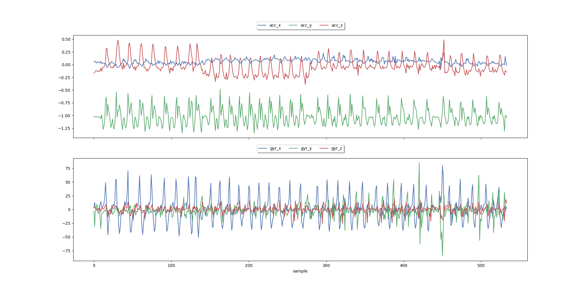

### 3. Outlier Removal (`outlier_removal.py`)
- Statistical techniques (e.g., Z-score and IQR-based filtering) are applied to detect and remove extreme outliers.
- Removing outliers improves the model’s performance by preventing bias from erroneous data.

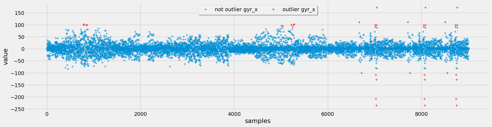
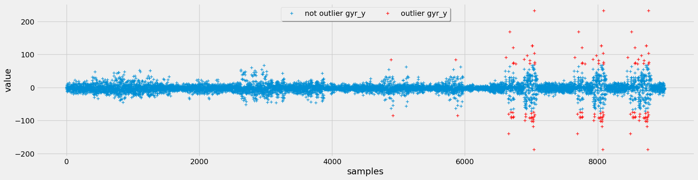

### 4. Feature Engineering (`build_features.py`)
Various feature extraction techniques were implemented to improve model performance:

#### **4.1 Low-Pass Filtering**
- A low-pass filter is applied to smooth sensor readings and remove high-frequency noise.
- Enhances the ability to detect repetitions more accurately.


#### **4.2 Temporal Abstraction**
- Aggregated statistical features such as mean, standard deviation, min, and max over a rolling window.
- Helps capture time-dependent variations in the signal.

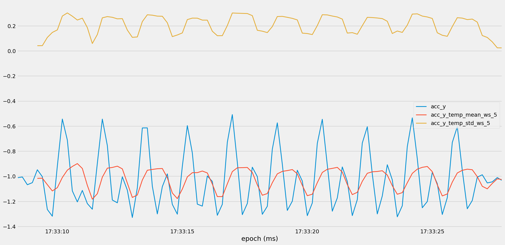
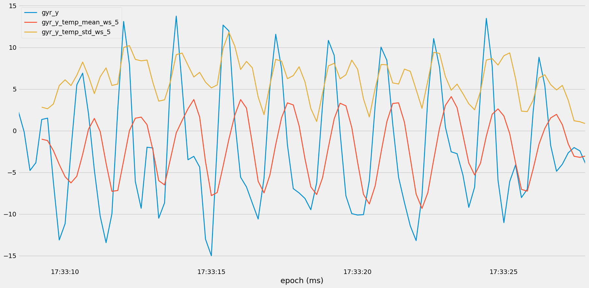

#### **4.3 Frequency Abstraction**
- Extracts frequency-domain features using Fourier Transform.
- Captures periodic movement patterns that are essential for distinguishing exercises.

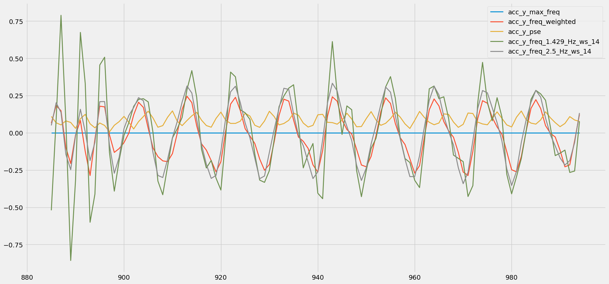

### **4.4 Clustering of the data (KMeans)**

- KMeans clustering is applied to accelerometer data to identify movement patterns.
- The optimal number of clusters is determined using the Elbow method, and 3D scatter plots visualize the clustered data.
- This approach extracts features that improve exercise classification by capturing latent movement variations.

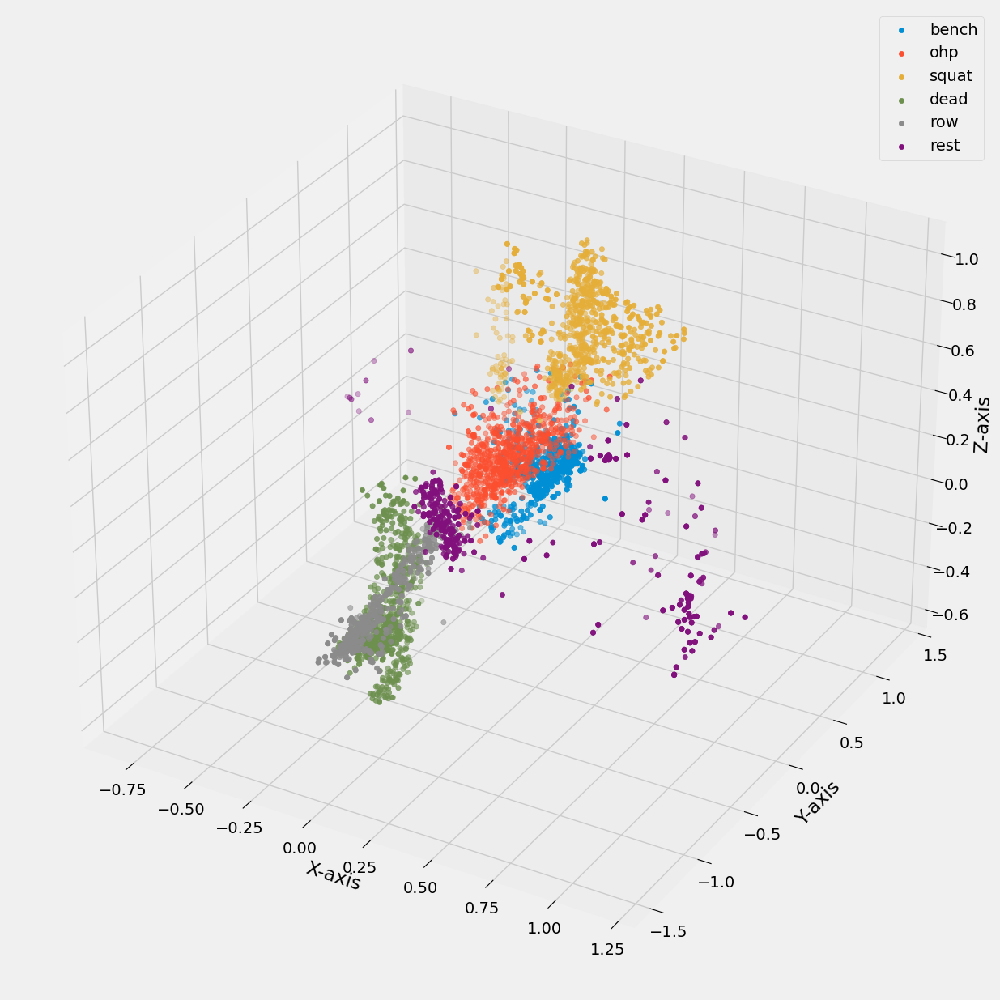

### 5. Model Training (`train_model.py`)
- Multiple machine learning models, including Random Forest, Neural Networks, Decision Trees, KNN, and Naive Bayes, were trained and evaluated.
- Hyperparameter tuning was performed to optimize accuracy.
- A comparison of different models based on accuracy is studied.

### 6. Repetition Counting (`count_repetitions.py`)
- The number of repetitions performed in each exercise is counted using peak detection techniques.
- A low-pass filter is applied to smooth the acceleration magnitude before counting peaks.
- The results are evaluated against known repetition counts using Mean Absolute Error (MAE).

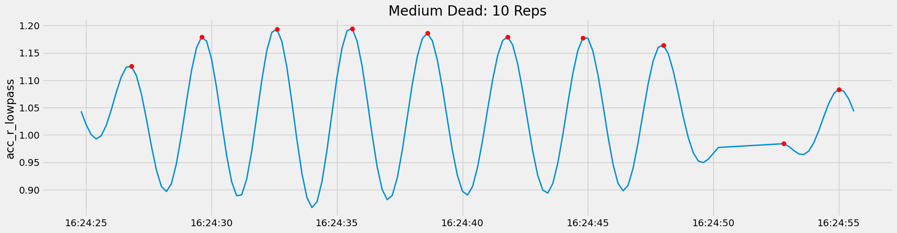

## Results
### **1. Model Accuracy Comparison**
The table below shows the accuracy of different models trained on various feature sets:

| Model | Feature Set | Accuracy |
|--------|--------------|------------|
| RF | Feature Set 4 | **99.59%** |
| NN | Feature Set 4 | **99.48%** |
| RF | Selected Features | 98.97% |
| NN | Feature Set 3 | 98.76% |
| RF | Feature Set 3 | 98.55% |
| DT | Selected Features | 98.24% |
| DT | Feature Set 4 | 98.24% |
| NN | Selected Features | 97.31% |
| KNN | Feature Set 4 | 96.89% |
| DT | Feature Set 3 | 95.76% |

#### **Bar Graph Comparing Model Performance Across Feature Sets**

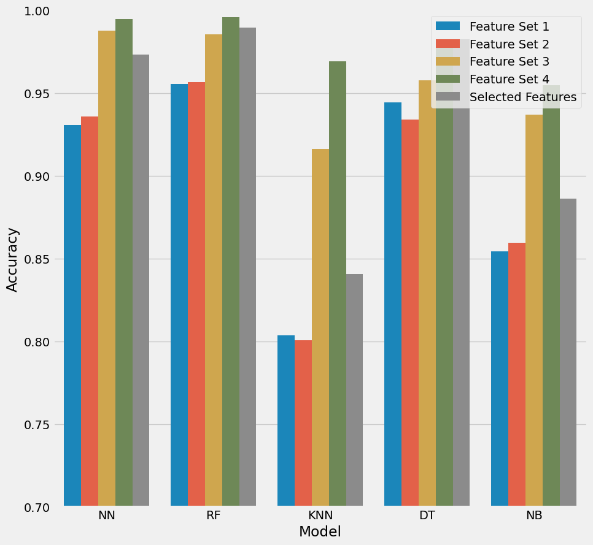

### **2. Confusion Matrices**
#### **Random Forest (Feature Set 4)**
- **Accuracy:** 99.59%

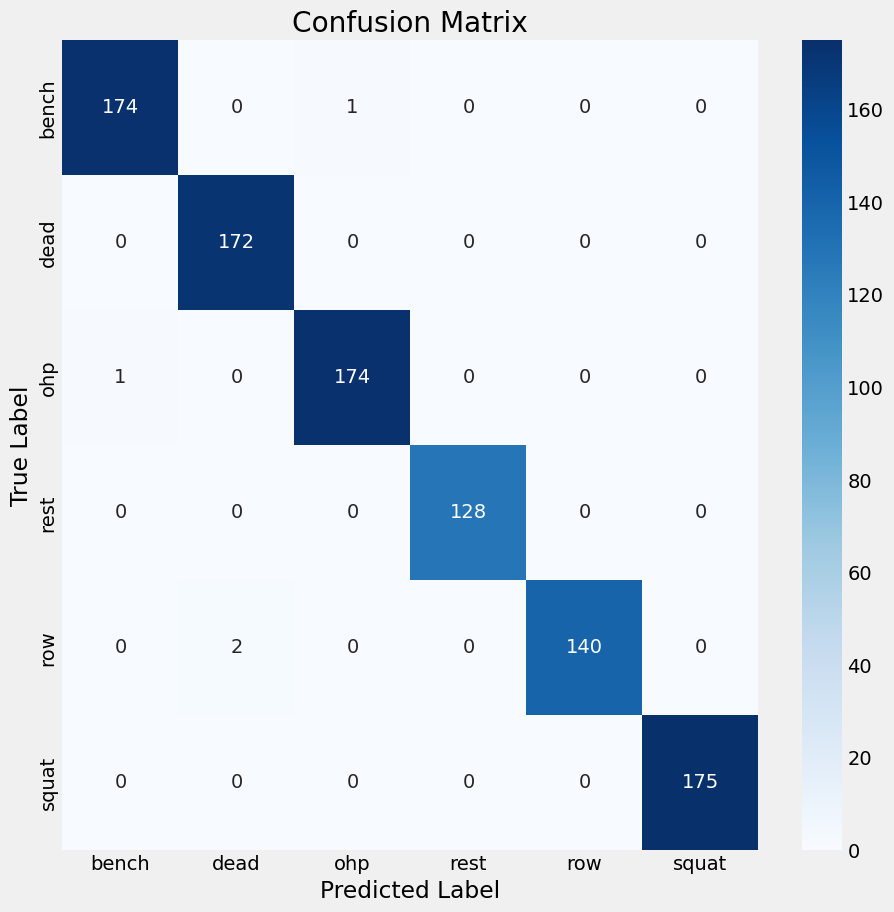

#### **Random Forest (Participant-Wise Data)**
- **Accuracy:** 99.45%

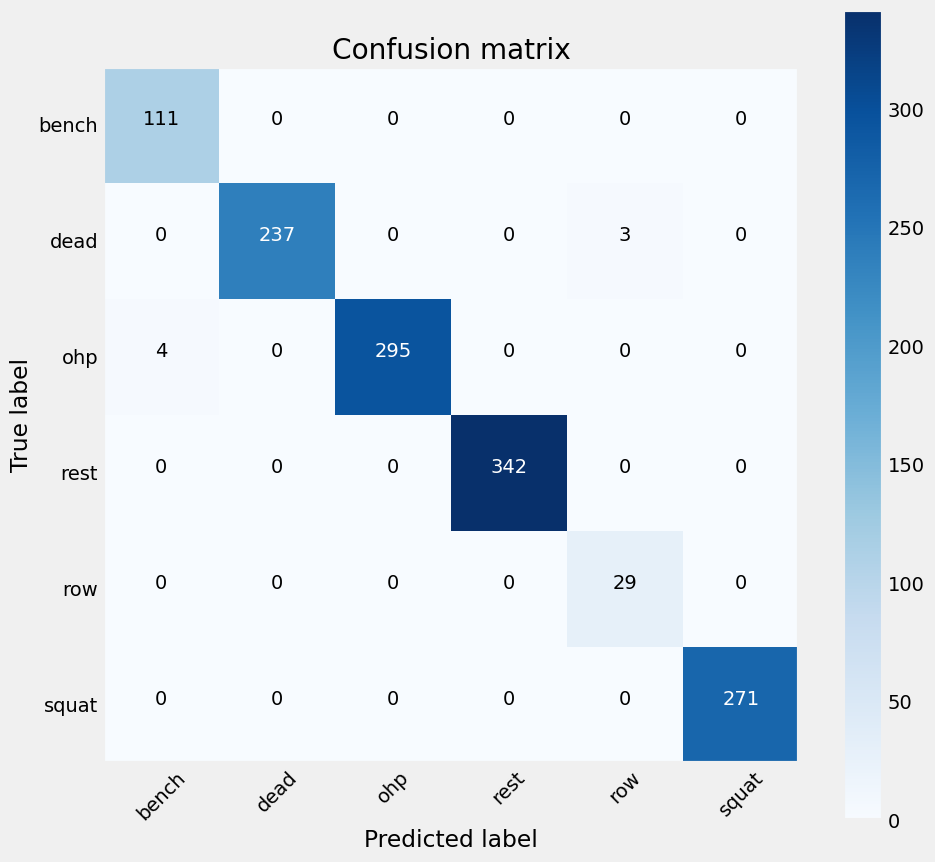

#### **Neural Network (Feature Set 4)**
- **Accuracy:** 99.45%


### **Repetition Prediction Results**

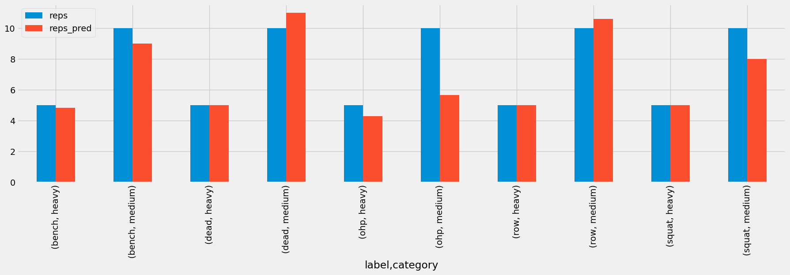

## Conclusion
- Random Forest and Neural Network models achieved the highest accuracy, making them ideal for classifying exercises.
- Feature engineering significantly improved classification performance.
- The repetition counting script performed well, with minimal error in rep counts.
- The final models are robust and generalize well across different participants.

## How to Run the Project
### **1. Setup Environment**
```
conda env create -f environment.yml
conda activate barbell-classification
```

### **2. Run Scripts**
- **Train the Model:** `python src/models/train_model.py`
- **Count Repetitions:** `python src/features/count_repetitions.py`
